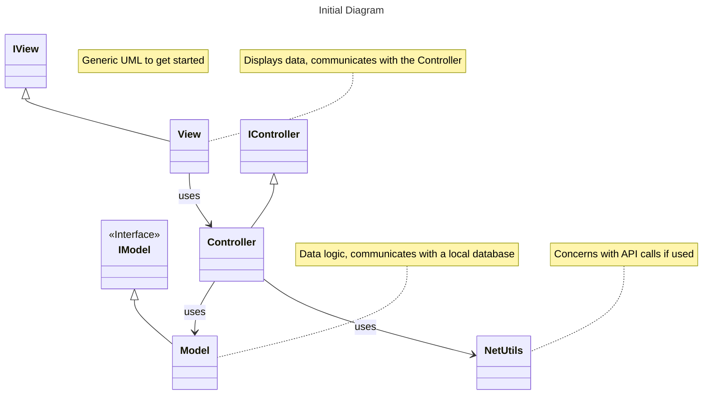
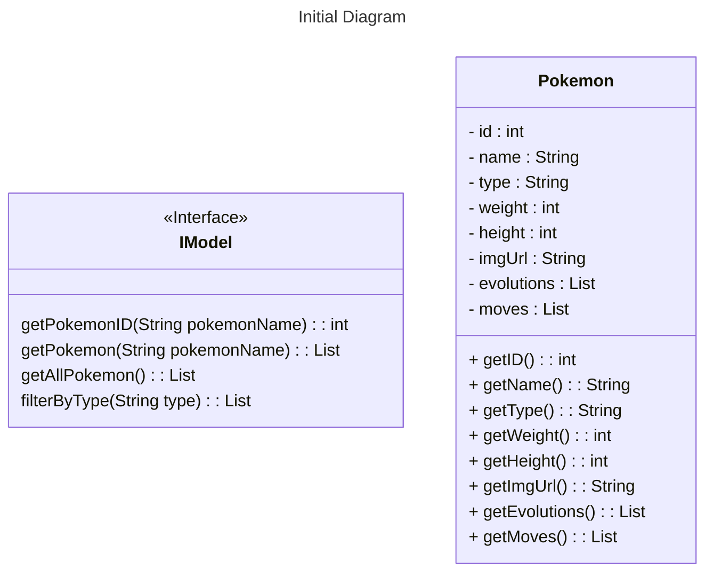

# Product Proposal
* The project proposal file is located at `DesignDocuments/proposal.pdf`.
 
[Project Proposal PDF](proposal.pdf)
  
* The project demonstration file is located at `DesignDocuments/demonstration.pdf`.
 
[Project Demonstration PDF](demonstration.pdf)
  
* The initial UML diagram is provided below.
* The final UML diagram is located at `README.md`

## Initial Design

## About
* What are you building?
PokeDex app.

* What are the initial features for the application?
Search for individual pokemon and list all pokemon.

* What are the *minimum* additional features you plan to implement?
Click on each pokemon in the list displayed, have an option to go to a view page for each individual pokemon.

* What are your stretch goals (features beyond the minimum)?
* Go over your initial design.

  * Special emphasis should be placed on how you plan to break it up

  * MVC, presenter, file management, different input validation, testing, documentation, etc.

* How do you plan to break up the work?

* What is your teams timeline and major check-in points?

### Professor's notes:
* Pick which feature you want to implement
* Create a branch for that feature/aspect of the project
* Work on that aspect.
* Do a pull request when done (while you were working in your branch)
* Have someone else go over your code to review and merge back into main
* Delete the branch
* Repeat for another feature/aspect as you grow the assignment
