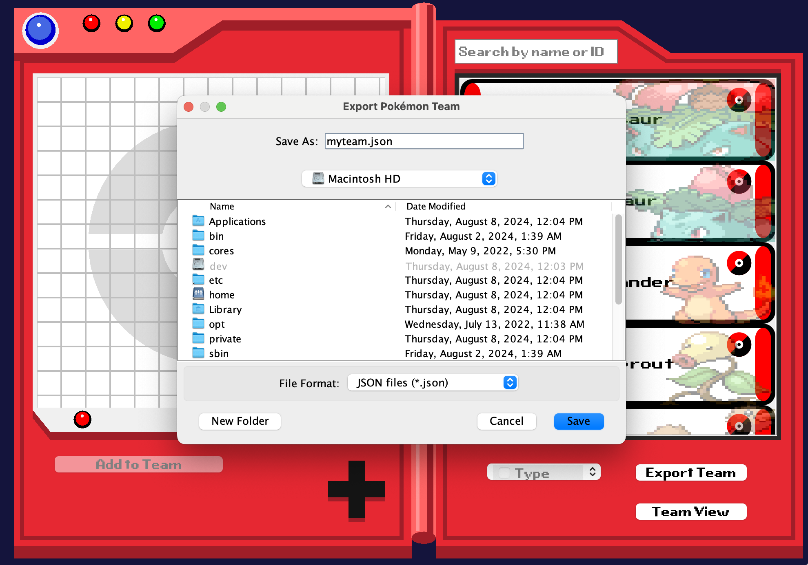
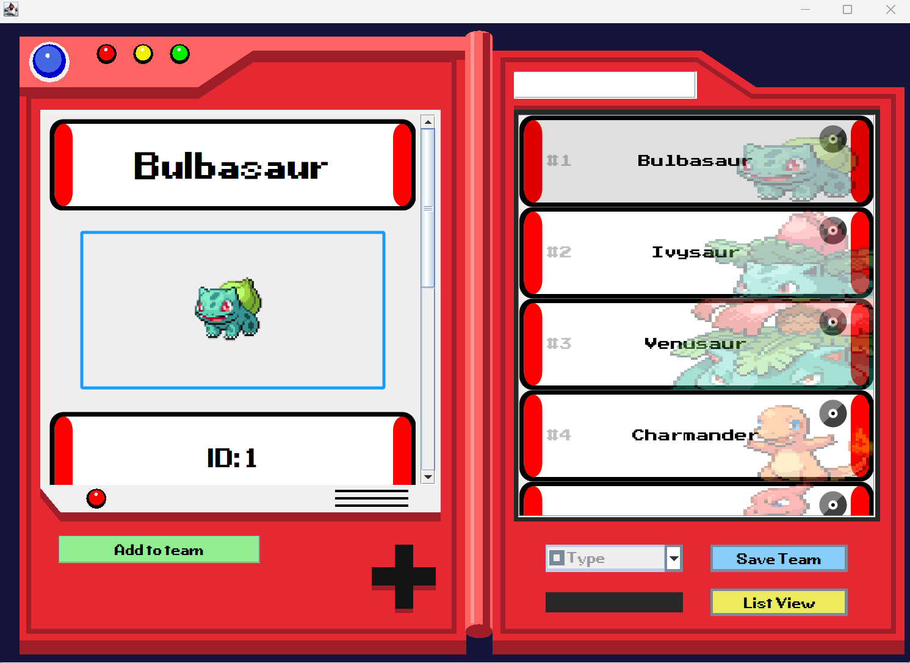

# PokedexApp

## Introduction

The PokedexApp allows users to view a list of pokemon from 1st generation with the ability for filter by name, id, and type. It features an individual screen displaying each pokemon, and a team screen, allowing the user to add and remove pokemon from the team.

<div style="display: flex; justify-content: center;">

</div>

## Features

- Scroll through the list of pokemon
- Display individual pokemon information
- Add/remove pokemon to/from team
- Save the pokemon team as a json file
- Filter the list by name, id, and type
- Play the cry of each pokemon
- See a detailed list of moves for each pokemon

## Installation

### Prerequisites

- Java Development Kit (JDK) installed

### Steps

#### 1. Clone the repository:

```bash
git clone https://github.com/Su24-CS5004-Online-Lionelle/final-project-group-6.git
```

#### 2. Navigate to the project directory

```bash
cd final-project-group-6
```

#### 3. Refresh dependencies

- Unix-based system (MacOs, Linux)

```bash
./gradlew build
```

- Windows

```bash
gradlew.bat build
```

## Usage

#### Run the program

```bash
java -jar build/libs/PokemonApp.jar
```

### Pokemon List View

- Shows the list of `Pokemon` from 1st generation.
  <br><br>
  
  <br><br>

### Pokemon Team View

- Shows the list of `Pokemon` added to the team.
  <br><br>
  
  <br><br>

### Searching and filtering

- The right side of the UI enables searching by pokemon name, id, and filtering by type

#### Searching by name or id

<div style="display: flex;">
    
    
</div>

#### Filtering by type

<div>
  
</div>

### Exporting the team file

- Users can export their team file after adding pokemon to the team by clicking on the export button and choosing the directory on their local machine

<div>
    
    
</div>

- JSON file example

<div>
    
</div>

### Individual Pokemon page

- When the user click on a `specific Pokemon` in `List View` or `Team View` from the `right` side, `an introduction page` for `that Pokemon` will display on the `left` side.
  <br><br>
  
  <br><br>
- At the `top` is the `Pokemon's name`, followed by its `image` in the` middle`, and `below` are `ID, weight, height, types, and moves` details.
  <br><br>
  
  <br><br>
  
  <br><br>
- `Clicking` on the `image` will `play` that `Pokemon's cry`.
  <br><br>
  Example sound file: (Instructions/IndiviPokePage/cries_pokemon_latest_1.ogg)
  <br><br>
  
  <br><br>
- The user can click on `moves panel` to view detail information. A `table` with the `name of the moves`, `accuracy`, `power`, `PP`, and `damage type` will be displayed on the screen.
  <br><br>
  
  <br><br>
- Columns can be sorted by descending or ascending through clicking each header.


- When table closed, return to the general introduction page.

## License

This project is open source.

You are free to:

- **Use**: Copy, modify, and distribute the software, including for commercial purposes.
- **Adapt**: Remix, transform, and build upon the material.

Under the following terms:

- **No Warranty**: The software is provided "as is", without warranty of any kind.
