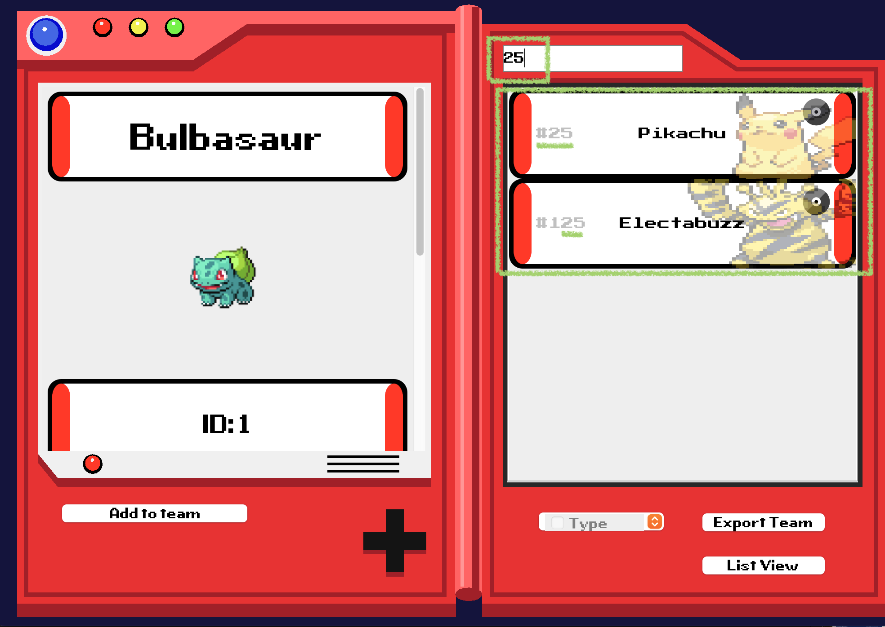

# Testing History

## Below are the happy paths

- **GUI loads:** Make sure GUI loads with a search bar, a list of all pokemons, and 4 buttons (`Add to Team`, `Type`, `Export Team` and `List View`).

- **Clicking a Pokemon:** Make sure that clicking a pokemon in the list view prompts the left side of the screen to showcase the basic information of the pokemon, such as its name, image, id, weight, height, etc.

- **Clicking Moves:** After clicking Moves in the Pokemon panel, another window will pop up with a table of moves. The moves can be filtered in ascending or descending order based on ASCII values for text or by the lowest/highest number.

For example when `Power` is clicked, the moves are filtered in descending order.

- **Search by `name` or `id`:** Ensure that search bar on top allows users to search pokemons by their name or by their id number.

By name:

By number:

- **Filter by `Type`:** Make sure that pokemons can be filtered and sorted by `types`, such as bug, electric, fire, grass, etc.

Filtering by one type - fire:

Filtering by multiple types - fire and flying:

- **Clicking `Export Team`:** After clicking `Export Team`, an export popup shows options to enter file name, choose a folder, select file format, and buttons to create a new folder, cancel, or save. Make sure each button works as intended and file is properly saved and can be found.

Creating a new folder:

Creating a file in the folder and saving it:

Popup alerts user that file has been saved:

Find the saved file in user computer:

Pokemon team information is saved as JSON:

## Below are the edge cases 
These tests make sure that the Pokemon searches and filtering handles the edge cases. These tests alphabet, numerical, and symbol names during search. To test filtering, it tests for selecting all the available types and selecting none of the available types.

